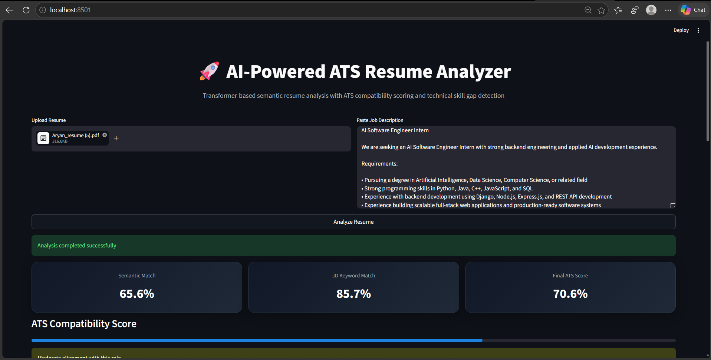

# 🚀 AI-Powered ATS Resume Analyzer

## 📌 Overview
AI-Powered ATS Resume Analyzer is a transformer-based resume screening web application designed to automate candidate-job fit analysis. It compares uploaded resumes against job descriptions using semantic similarity and ATS-style technical keyword analysis to help recruiters and hiring teams make faster screening decisions.

This project demonstrates applied NLP, transformer embeddings, PDF parsing, and intelligent resume evaluation workflows in a recruiter-focused interactive dashboard.

---

## ✨ Features

- 📄 Upload resumes in PDF or TXT format
- 📝 Paste job descriptions for instant analysis
- 🧠 Transformer-based semantic resume matching
- 🎯 ATS compatibility scoring
- 🔍 Technical keyword extraction and skill gap analysis
- ⚠ Missing skill identification
- 📊 Interactive recruiter-style dashboard
- 💻 CPU / GPU execution environment detection

---

## 🧠 How It Works

### 1. Resume Parsing
The uploaded resume is parsed and converted into clean text using PDF/TXT extraction.

### 2. Semantic Matching
The system uses **Sentence Transformers (all-MiniLM-L6-v2)** to generate embeddings for:
- Candidate resume
- Job description

Cosine similarity is then used to calculate semantic relevance.

### 3. ATS Keyword Analysis
A curated technical keyword taxonomy is used to identify:
- Matching technical skills
- Missing technical skills
- Job description keyword overlap

### 4. Final ATS Scoring
Final compatibility score is computed using weighted scoring:

- **75% Semantic Match**
- **25% JD Keyword Match**

This creates a more realistic ATS-style compatibility score.

---

## ⚙️ Tech Stack

### Core Technologies
- Python
- Streamlit

### AI / NLP
- Sentence Transformers
- Hugging Face Transformers
- Scikit-learn
- PyTorch

### Document Processing
- PyPDF2

---

## 📊 Example Output

The application provides:

- Semantic Match Score
- JD Keyword Match Score
- Final ATS Compatibility Score
- Matching Technical Skills
- Missing Technical Skills
- Execution Environment Info

Example:

```text
Semantic Match: 57.0%
JD Keyword Match: 33.3%
Final ATS Score: 51.1%

Matched:
Python, LangChain, RAG

Missing:
PyTorch, Hugging Face, API Integration, Vector Database
```

---

## 🖥️ Run Locally

### Clone Repository
```bash
git clone https://github.com/Aryanshete/resume-screening-ai.git
cd resume-screening-ai
```

### Install Dependencies
```bash
pip install -r requirements.txt
```

### Launch Application
```bash
streamlit run app.py
```

---

## 📸 Demo Screenshot



---

## 💡 Use Cases

- ATS Resume Screening
- Recruitment Automation
- Candidate Shortlisting
- Resume-Job Fit Analysis
- HR Tech Prototyping
- AI-powered Hiring Workflows

---

## 🔮 Future Enhancements

- Batch multi-resume candidate ranking
- Resume database screening
- Vector database integration (FAISS / Chroma)
- FastAPI backend APIs
- LLM-generated recruiter feedback
- Cloud deployment
- Recruiter analytics dashboard

---

## 👨‍💻 Author

**Aryan Shete**  
Artificial Intelligence & Data Science Student


